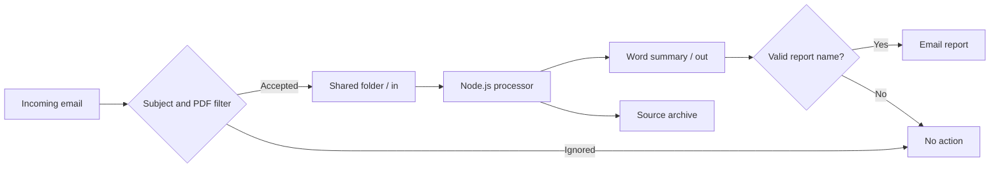

# Tender Digest Automation

A sanitized reference implementation that turns a procurement digest into a concise Word report and demonstrates a practical email-to-report workflow across Microsoft 365 and a small Node.js processor.

> This public repository is a sanitized reference implementation built with synthetic data. It contains no production documents, tenant-specific identifiers, recipients, or company-specific rules, and is not affiliated with any procurement platform or public authority.

## Case study at a glance

**Situation** — A recurring procurement digest arrived by email as a PDF and required manual review, summarization and forwarding.

**Problem** — The workflow crossed cloud email, shared document storage and a local processing step. That introduced repetitive work plus reliability risks around attachment filtering, synchronization, duplicate outputs and partially written reports.

**Approach** — I separated acquisition, processing and delivery into distinct stages: Power Automate handles transport, a small Node.js processor parses and filters the document, and a second flow delivers only validated report artifacts. Stability checks, an exclusive process lock, atomic writes, logging and archive rules make the hand-offs safer.

**Outcome** — The manual email-to-report routine becomes a repeatable, observable workflow with explicit failure boundaries and reusable components.

## My role

I treated this primarily as a workflow-integration problem rather than a document-generation script:

- mapped the end-to-end process and its failure points;
- separated cloud transport from local document processing;
- defined safety rules for file stability, concurrency, output visibility and delivery;
- implemented the Node.js parsing/reporting component and generic Microsoft 365 integration pattern;
- added tests and negative-path scenarios before presenting the project as a reusable reference implementation.

## The problem

A recurring procurement digest arrived by email as a PDF. The original process required someone to notice the message, download the attachment, review many notices, prepare a concise Word report and forward it to the appropriate recipient.

The goal was to make that workflow reliable without tying the project to a specific company or Microsoft 365 tenant:

- detect relevant messages when the subject contains a configurable keyword;
- ignore messages that do not contain a PDF;
- turn the digest into a consistent, readable DOCX report;
- avoid processing or sending the same document more than once;
- connect cloud email and document storage with a small local processor;
- keep a traceable archive and recover safely from interrupted runs.

## How the solution evolved

The first prototype proved that structured text could be extracted from a digest and converted into a useful Word report. The main challenge then moved from document generation to orchestration: cloud flows, local file synchronization and report delivery do not always complete at the same instant.

The final design therefore introduced:

- a broad subject check followed by a strict PDF attachment check;
- separate inbox, output and archive folders as durable hand-off points;
- a file-stability delay before processing synchronized files;
- a lock file to prevent overlapping processor runs;
- atomic report writes so downstream automation never sees a partial DOCX;
- an output-collision guard and archival only after successful processing;
- an output filename rule so unrelated Word files are never emailed;
- two small cloud flows around the Node.js processor, keeping each responsibility easy to test.

A fuller account of the decisions and acceptance tests is available in [the case study](docs/case-study.md).

## What it demonstrates

- filtering incoming email attachments in Power Automate;
- storing source files in a synchronized SharePoint-style folder;
- extracting text from PDF or plain-text digests;
- selecting relevant opportunities through configurable rules;
- generating a formatted `.docx` summary;
- output-collision protection, input archiving, logging, and an atomic process lock;
- sending only valid report files through a second cloud flow.

## Architecture



The cloud flows handle transport and notifications. The local Node.js component handles document parsing and report generation. Keeping these responsibilities separate makes the workflow easier to test and replace.

## Quick start

Requirements: Node.js 20 or newer.

```bash
npm install
npm test
npm run demo
```

The demo uses `sample-data/sample-digest.txt` and creates `demo-output.docx`. All names, organizations, values, and dates in the fixture are fictional.

## Folder processor

Copy the example configuration and create the input folders:

```bash
cp config.example.json config.json
mkdir -p data/in data/out data/archive data/logs
```

Place a `.txt` or compatible `.pdf` digest in `data/in`, wait for the configured stability interval, then run:

```bash
node src/process-inbox.js config.json
```

In production-like environments, schedule this command with Task Scheduler, cron, or a container job. Generated reports appear in `data/out`; processed source files move to `data/archive`.

## Microsoft 365 integration

The repository intentionally does not include exported Power Automate packages or connection references. Follow [docs/power-automate.md](docs/power-automate.md) to recreate the two generic flows with your own tenant, mailbox, and document library.

## Design decisions

- Configuration is external to the code.
- Files must be stable before processing.
- The processor acquires an exclusive lock before work begins, reducing the risk of overlapping runs.
- Reports are written through a temporary file before becoming visible in the output folder.
- If the expected output report already exists, another delivery artifact is not created for that filename.
- Notification flows validate both the filename prefix and `.docx` extension.

## Privacy and scope

No real tenders, email addresses, URLs, tenant identifiers, credentials, exported connections, company names, or production documents are included. See [SECURITY.md](SECURITY.md).

## Result

The workflow was validated with synthetic data and negative-path tests. A valid new PDF produces one report artifact; mixed attachments pass only the PDF; an existing output filename does not produce another report; unrelated Word files are ignored by the delivery rule; and failed inputs remain diagnosable instead of silently disappearing.

This repository demonstrates the reusable engineering pattern, while tenant-specific connections, business rules and real documents remain outside source control.

## License

MIT
